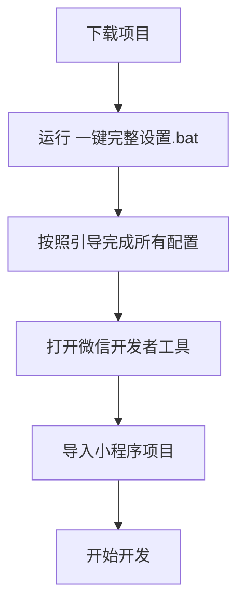
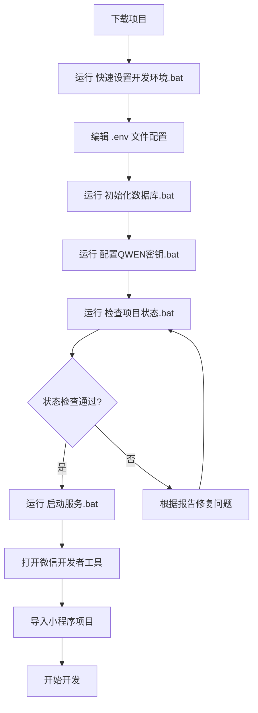
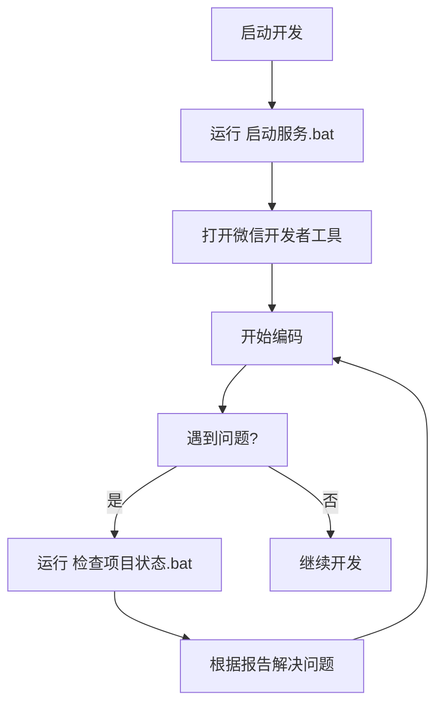

# 🛡️ 社区食安AI小卫士 - 项目工具总览

> 为开发者和用户提供的完整工具集和文档指南

## 📋 项目概况

**项目名称**: 社区食安AI小卫士  
**项目类型**: 微信小程序 + FastAPI后端  
**开发状态**: 核心功能完成，配置部署阶段  
**技术栈**: Python + FastAPI + PostgreSQL + Redis + 微信小程序  

## 🛠️ 一键式工具

### 🚀 快速启动工具

| 工具名称 | 文件名 | 功能描述 | 使用场景 |
|---------|--------|----------|----------|
| **完整项目设置** | `一键完整设置.bat` | 完整的引导式设置流程，整合所有配置步骤 | 新用户首次设置 |
| **开发环境设置** | `快速设置开发环境.bat` | 一键配置Python环境、虚拟环境、依赖安装 | 首次使用项目 |
| **数据库初始化** | `初始化数据库.bat` | 自动化数据库初始化、创建表结构、插入示例数据 | 首次部署或重置数据库 |
| **API密钥配置** | `配置QWEN密钥.bat` | 配置和管理QWEN API密钥 | 启用AI功能 |
| **项目状态检查** | `检查项目状态.bat` | 全面检查项目配置、服务状态、环境完整性 | 排查问题、验证配置 |
| **服务启动** | `启动所有服务.bat` | 启动Redis和FastAPI后端服务 | 日常开发使用 |
| **Redis启动** | `start_redis.bat` | 单独启动Redis缓存服务 | Redis服务异常时 |

### 🔍 检测和诊断工具

| 工具名称 | 文件名 | 功能描述 | 输出内容 |
|---------|--------|----------|----------|
| **系统连接测试** | `test_system.py` | 测试数据库、Redis、API服务连接状态 | 服务状态报告 |
| **项目状态检查** | `检查项目状态.py` | 深度检查项目配置完整性和服务状态 | 详细诊断报告 |

## 📚 文档指南

### 🎯 核心文档

| 文档名称 | 文件名 | 内容概述 | 目标用户 |
|---------|--------|----------|----------|
| **配置指南** | `配置指南.md` | API密钥配置、微信小程序设置、Redis启动 | 开发者 |
| **小程序开发指南** | `小程序开发指南.md` | 微信开发者工具配置、项目导入、调试发布 | 前端开发者 |
| **快速使用指南** | `快速使用指南.md` | README同步工具使用说明 | 项目维护者 |
| **项目计划书** | `小程序项目计划书.md` | 6周开发计划、技术架构、成功指标 | 项目管理者 |

### 📖 技术文档

| 文档名称 | 文件名 | 技术内容 | 适用场景 |
|---------|--------|----------|----------|
| **API配置** | `miniprogram/config/api.js` | 前端API地址配置、环境切换 | 前端开发 |
| **工具总览** | `项目工具总览.md` | 项目所有工具和文档的汇总说明 | 项目概览 |

## 🔧 配置文件

### 📄 环境配置

| 文件名 | 用途 | 配置内容 | 注意事项 |
|--------|------|----------|----------|
| `.env` | 环境变量配置 | 数据库、API密钥、微信配置 | 需要手动填写真实配置 |
| `requirements.txt` | Python依赖 | 后端服务所需的Python包 | 自动安装 |
| `miniprogram/app.json` | 小程序配置 | 页面路由、权限、样式配置 | 已配置完成 |

## 🚀 使用流程

### 🆕 新用户快速开始

#### 方式一：一键完整设置（推荐）⭐

#### 方式二：分步设置

### 🔄 日常开发流程

## 📊 项目状态

### ✅ 已完成功能

- **后端架构**: FastAPI + PostgreSQL + Redis
- **API接口**: 用户认证、营养检测、举报管理等
- **数据库模型**: 完整的数据表结构
- **前端框架**: 微信小程序页面结构
- **配置管理**: 环境变量和API配置
- **开发工具**: 一键式启动和检查工具

### 🔧 需要配置的项目

- **API密钥**: Qwen AI、OCR服务
- **微信小程序**: AppID、AppSecret、服务器域名
- **数据库**: PostgreSQL连接配置
- **Redis服务**: 缓存服务启动

### 📈 完成度评估

| 模块 | 完成度 | 状态 | 备注 |
|------|--------|------|------|
| **代码开发** | 85% | ✅ 基本完成 | 核心功能已实现 |
| **功能实现** | 80% | ✅ 基本完成 | 主要功能可用 |
| **配置部署** | 40% | 🔧 需要配置 | 需要手动配置API密钥 |
| **测试验证** | 60% | 🧪 部分完成 | 基础测试已通过 |

## 🎯 下一步行动

### 🔑 优先级1 - 必须完成

1. **配置API密钥**
   - 申请Qwen AI API密钥
   - 配置OCR服务（腾讯云/阿里云）
   - 更新`.env`文件

2. **注册微信小程序**
   - 申请小程序账号
   - 获取AppID和AppSecret
   - 配置服务器域名

### 🚀 优先级2 - 建议完成

1. **部署到云服务器**
   - 选择云服务提供商
   - 配置域名和SSL证书
   - 设置自动化部署

2. **完善测试**
   - 编写单元测试
   - 进行集成测试
   - 用户体验测试

### 🌟 优先级3 - 可选优化

1. **性能优化**
   - 数据库查询优化
   - 缓存策略优化
   - 前端加载优化

2. **功能扩展**
   - 添加更多AI功能
   - 完善管理后台
   - 增加数据分析

## 📞 技术支持

### 🆘 常见问题

1. **Python环境问题**: 确保Python 3.8+已安装
2. **依赖安装失败**: 检查网络连接，使用国内镜像源
3. **数据库连接失败**: 确认PostgreSQL服务运行，检查连接配置
4. **Redis连接失败**: 运行`start_redis.bat`启动Redis服务
5. **API调用失败**: 检查API密钥配置和网络连接

### 📧 联系方式

- **项目仓库**: [GitHub Repository](https://github.com/Cooper1307/mininutriscan)
- **问题反馈**: [Issues](https://github.com/Cooper1307/mininutriscan/issues)
- **技术讨论**: [Discussions](https://github.com/Cooper1307/mininutriscan/discussions)

---

**最后更新**: 2024年12月
**文档版本**: v1.0
**项目状态**: 开发阶段，核心功能完成